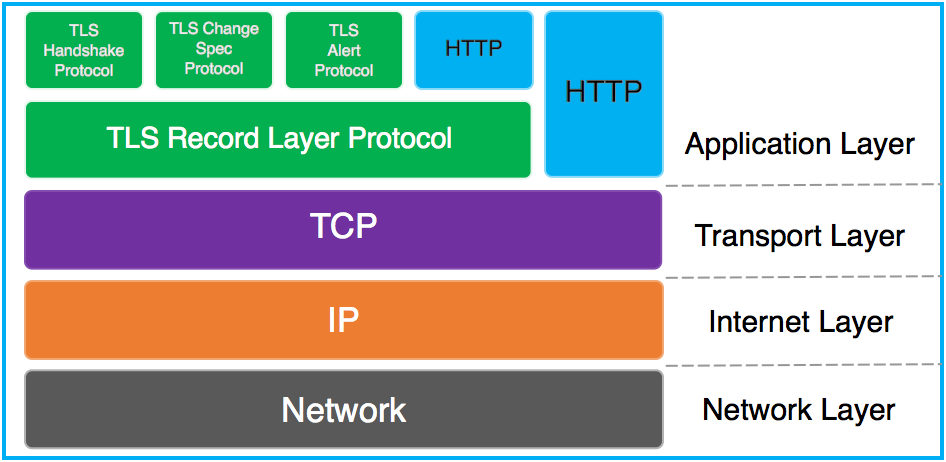
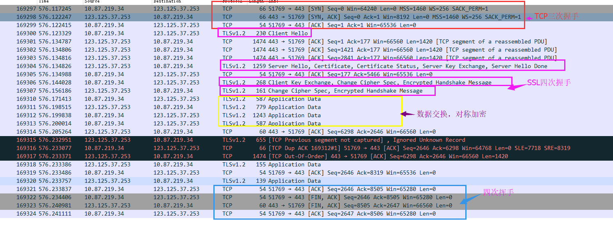
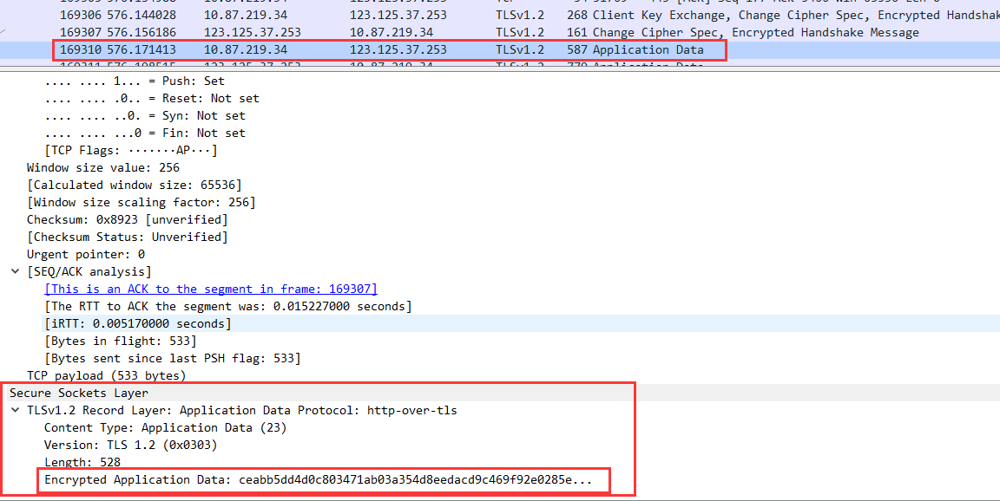

先来两个 Android 官网的 Guide
[Security with HTTPS and SSL](https://developer.android.com/training/articles/security-ssl.html)、[Network Security Configuration](https://developer.android.com/training/articles/security-config.htm)

关于 HTTPS 的概念

下图描述了在 TCP/IP 协议栈中 TLS (各子协议）和 HTTP 的关系

细节见 [HTTPS 工作原理](https://cattail.me/tech/2015/11/30/how-https-works.html) 以及腾讯的一篇文章 [Link](https://zhuanlan.zhihu.com/p/27040041)

自己也使用 Wireshark 抓取数据包

上图中可以看到 TCP 的握手过程，以及 TLS 的握手过程，握手通信过程是可见的，但确定了加密的秘钥之后，传输的内容就是被加密过的，详见下图：

抓取的数据包保存在百度网盘，输入过滤条件**tcp.stream eq 280**可以过滤出来想要的。
